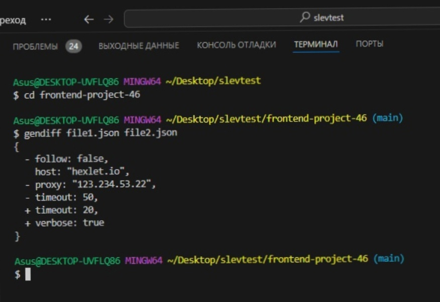
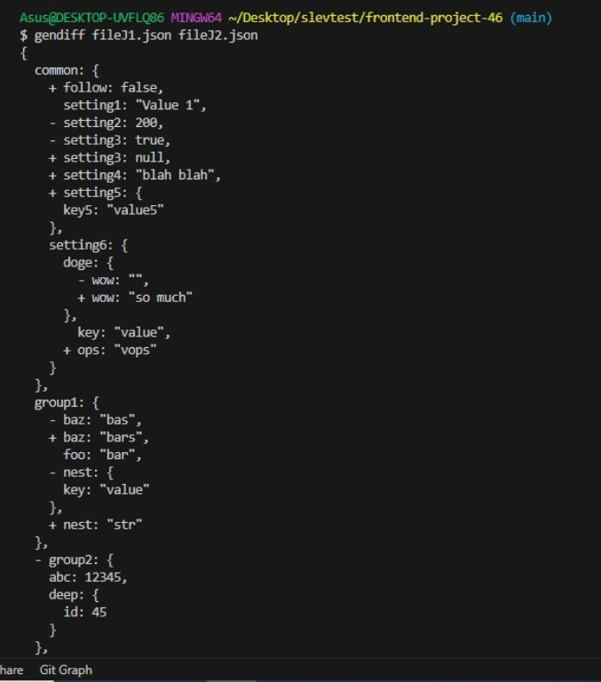
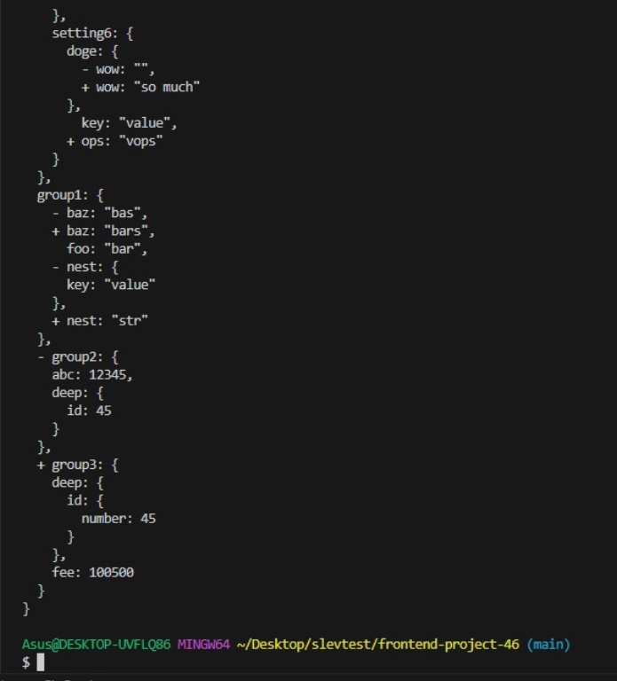
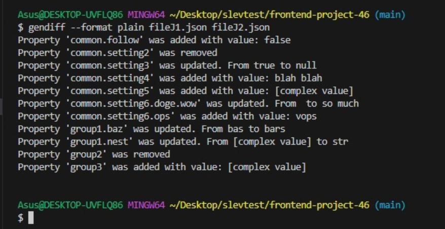
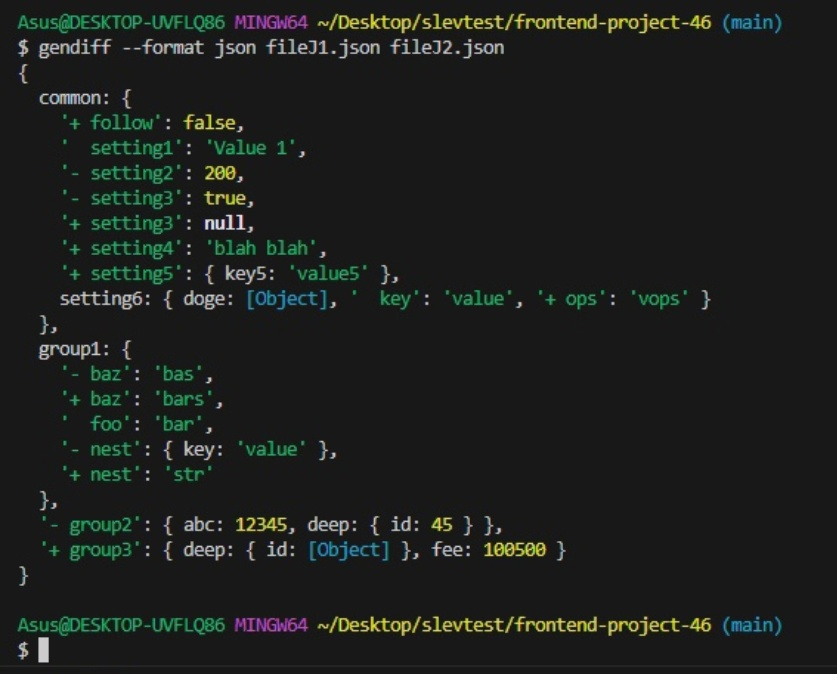

# nodejs-package

[](https://github.com/hexlet-boilerplates/nodejs-package/actions)
[](https://codeclimate.com/github/hexlet-boilerplates/nodejs-package/maintainability)
[](https://codeclimate.com/github/hexlet-boilerplates/nodejs-package/test_coverage)

## Setup

```bash
make install
```

## Run tests

```bash
make test
```

## screenshots:

### Сравнение плоских файлов (JSON)


### Сравнение плоских файлов (yaml)


### Formatter 'stylish'




### Formatter 'plain'


### Formatter 'json'


[](https://hexlet.io/?utm_source=github&utm_medium=link&utm_campaign=nodejs-package)

This repository was created by a Hexlet student. [Read more about Hexlet](https://hexlet.io/?utm_source=github&utm_medium=link&utm_campaign=nodejs-package).
